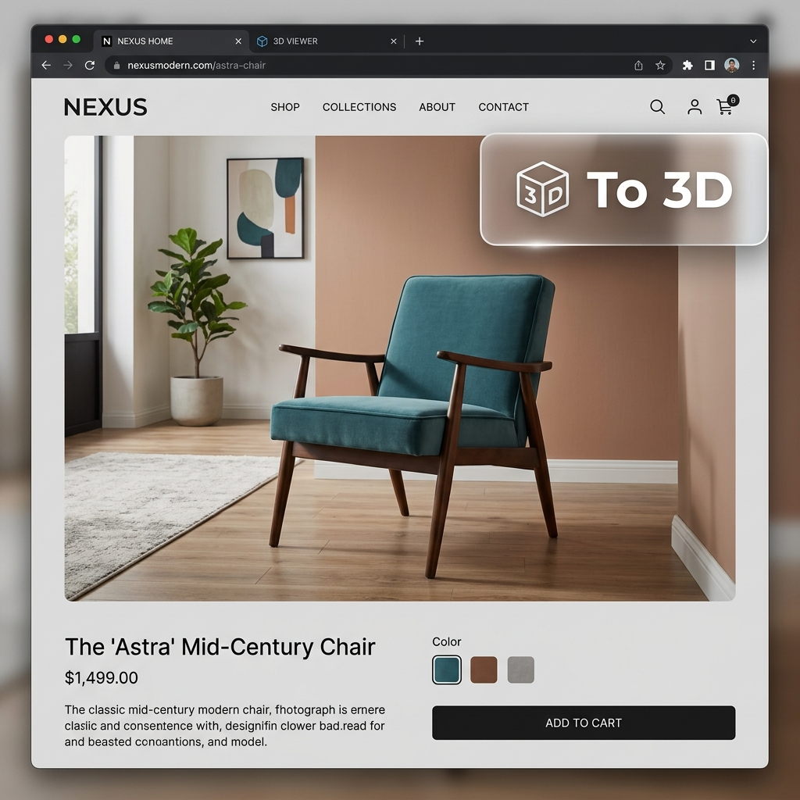
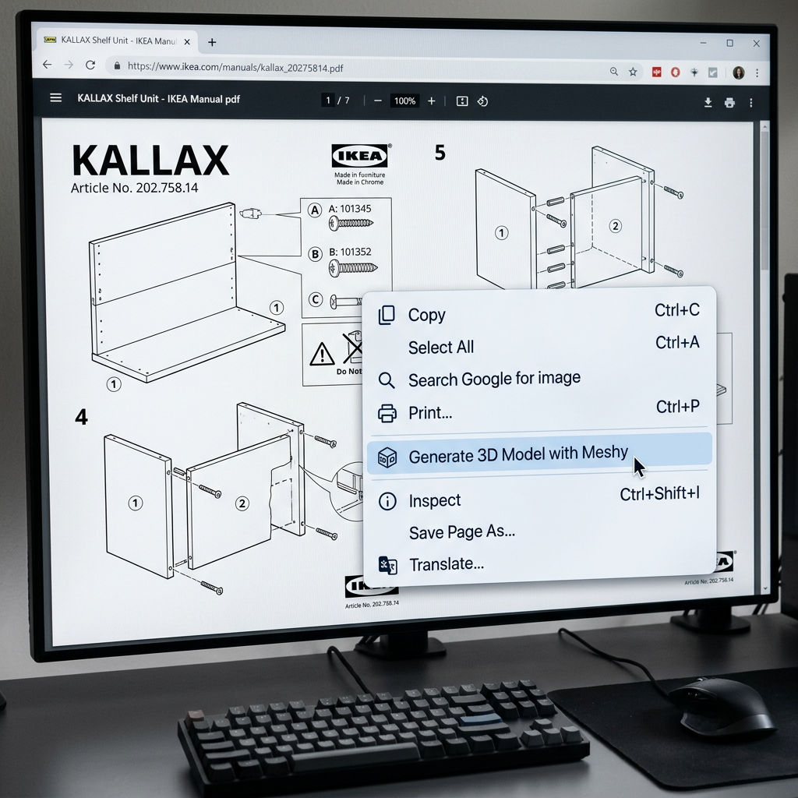
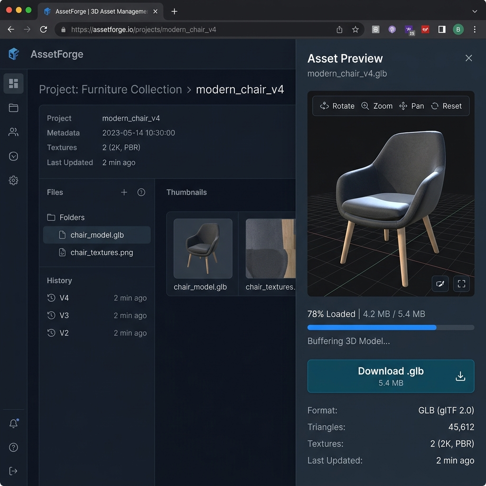

# Bringing 3D Generation to the Browser: A Chrome Extension built with Meshy API.

Have you ever browsed a furniture website, found a chair you loved, and wished you could instantly pull it out of the screen and see it in 3D? Or perhaps you've stared at a flat schematic in an installation manual, trying to mentally rotate it to understand how the pieces fit together? 

For years, converting 2D images into 3D models required expensive software, hours of manual modeling, or complex photogrammetry setups. But with the recent explosion of Generative AI, that barrier has vanished. 

Today, we're going to explore how we built a **100% client-side Chrome Extension** that lets you right-click any image on the web and instantly generate a production-ready 3D model, powered by the **[Meshy API](https://www.meshy.ai/)**.

---

## 1. The Problem: Prototyping 3D is Too Slow and Too Expensive

For developers, designers, and e-commerce retailers, 3D assets are becoming a baseline expectation. Customers want to view products in AR, game developers need rapid prototyping pipelines, and educators need interactive models. 

But building a pipeline to generate these assets usually means:
1. Setting up massive, expensive GPU clusters.
2. Managing complex neural radiance field (NeRF) or diffusion models.
3. Building heavy backend infrastructure to handle 10-minute generation queues.

Here, we'll show that you don't need any of that. We wanted a tool that lived directly in the browser, required zero backend infrastructure, and could turn any web image into a `.glb` file in seconds.

---

## 2. The Solution: The Meshy 3D Generator Extension

We built an open-source Chrome Extension that completely streamlines this workflow. You can check out the full source code and installation instructions on our GitHub repository: **[rpaik/meshy-chrome-extension](https://github.com/rpaik/meshy-chrome-extension/blob/main/README.md)**.

### How It Works:
* **The Hover Widget:** When browsing standard webpages, the extension injects a "To 3D" button over images. 
* **The Context Menu:** For protected sites or PDF viewer sandboxes, you can simply right-click an image and select "Generate 3D Model with Meshy".
* **Native Side Panel:** The extension opens Chrome's native Side Panel, showing a live progress bar as it polls the API. Once finished, it renders the 3D model right in the browser.
* **Universal Uploads:** Browsing a local file? You can paste (e.g., Cmd+V) or upload images directly into the side panel.

---

## 3. The Extension in Action

Here is a look at the workflow from a user's perspective:

### Instantly Capture Images
While browsing, simply hover over any image to reveal the injected generation widget.

### Generate From Any Context
For PDFs, local files, or complex sites where the hover widget isn't ideal, the extension integrates directly into your right-click menu. Perfect for extracting models from digital assembly manuals!

### View and Download inside Chrome
The Side Panel handles the asynchronous polling and renders the final `.glb` file natively.

---

## 4. Under the Hood: How It Works

The extension is comprised of four main pieces that communicate with the Meshy API:

* **`manifest.json`**: Defines the extension's blueprint, granting the necessary permissions (like `sidePanel` and `<all_urls>`).
* **`content.js`**: Injects the hover widget on qualifying images and sends selected image URLs.
* **`background.js`**: Acts as the invisible service worker. It handles the right-click Context Menu logic, temporarily stores the selected image URL, and triggers the Side Panel to open.
* **`sidepanel.js`**: The brains of the operation. It reads the captured image, converts it into a Base64 data URI, and handles all the `fetch` API requests to Meshy. Because 3D generation takes time, it runs an asynchronous polling loop against `GET /v1/image-to-3d/{taskId}` until the `.glb` file is ready to render.

---

## 5. Conclusion: Why You Should Use the Meshy API

Building this extension took hours, not months. By using the Meshy REST API, we were able to completely offload the hardest parts of 3D generation. 

For developers, the benefits are massive:
* **Saves Money:** You don't pay for idle GPU servers or complex cloud infrastructure. You only pay for the exact models you generate via a simple API call (a typical API call for an image-to-3D generation costs only a few cents).
* **Saves Time:** You avoid the nightmare of converting machine learning outputs into usable graphics formats. Meshy returns standard `.glb` files that drop instantly into web viewers and game engines.
* **Ultimate Flexibility:** Because it's a standard REST API with asynchronous polling, it can be integrated into absolutely anything—from a Python script, to an iOS app, to a simple Chrome Extension.

Stop wrestling with complex 3D pipelines. Check out the [Meshy AI Documentation](https://docs.meshy.ai/en/api) and start building!

*P.S. We consider this extension a working prototype! If you have any questions, find bugs, or have ideas for improvements, please feel free to [open an issue on our GitHub repository](https://github.com/rpaik/meshy-chrome-extension/issues).*
